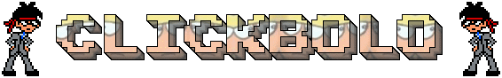

# Clickbolo

  

Shantae GBC engine for Clickteam Fusion 2.5

## Table of contents
<ul>
  <li><a href="#introduction">Introduction</a></li>
  <li><a href="#getting-started">Getting started</a></li>
  <li><a href="#controls">Controls</a></li>
  <li><a href="#faq">FAQ</a></li>
  <li><a href="#links">Links</a></li>
</ul>

## Introduction
Clickbolo is an open-source Shantae (Game Boy Color) engine for Clickteam Fusion 2.5 developed by Warrior555MainsGanon.

## Getting started
The only file you really need in this repo is the .mfa file (it's the source code of Clickbolo), simply download it and open it with Clickteam Fusion 2.5.

If you are downloading Clickbolo from the releases, the .zip will include 3 files:
-The latest .mfa
-A .exe of the demo if you just want to test the engine but you don't have Clickteam Fusion
-A readme.txt that is actually different from readme.md
## Controls
-Arrow keys: Dpad (move around)
-A key: B button (attack)
-S key: A button (jump)
-D key: Select button (dance)
-Return key: Start button (pause)
The following are debug hotkeys
-R key: Restart the level
-Escape key: Exit game
## FAQ
**Q:"My window is transparent for some reason, I can't play the demo!"**  
A:This demo uses D3D11, you can disable D3D by running the executable with the launch parameter "/DIB".

**Q:"Where can I get Clickteam Fusion 2.5?"**  
A:https://store.steampowered.com/app/248170/Clickteam_Fusion_25/

**Q:"Can you provide links to pirated Fusion 2.5 builds?"**  
A:No.

**Q:"Is there a GameMaker/Unity/Unreal Engine version?"**  
A:No, but if you are using GameMaker use Luke's Shantae GBC engine instead, it has way more features than current Clickbolo. Download: https://tsfp.forumotion.org/t332-shantae-gbc-example-for-game-maker-version-1-1-studio-8-1-and-5-3a-compatible

**Q:"Why is this called Clickbolo?"**  
A:I once saw somewhere a sprite of gbc Bolo pogging, this was where I really started to love this underrated character. I couldn't find again the sprite (edit: now I found it) but I decided to stick with the name. It's a pun of "Clickteam" and "Bolo".

**Q:"Where can I contact you/do you have a Discord?"**  
A:My tag is "Warrior555MainsGanon#2889". There is no Clickbolo discord server, but you can check the Megaman Zero Online community discord at https://discord.gg/X2ctJHypam

## Links
TBA
